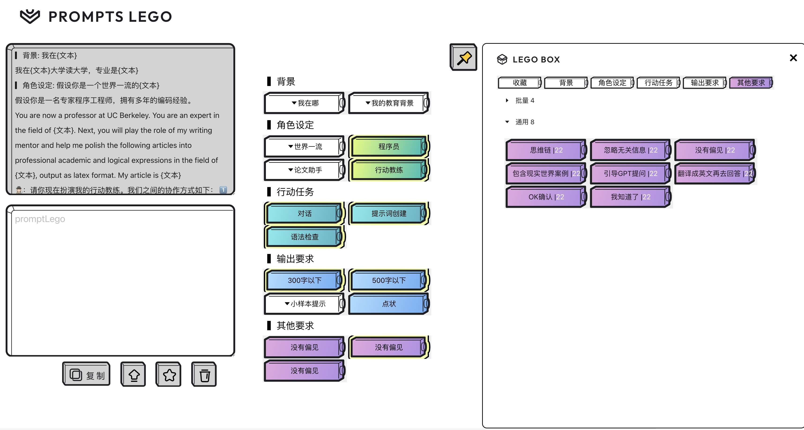
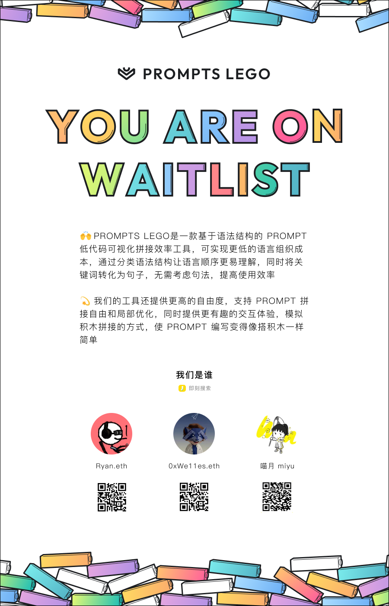

# Prompts 乐高


[](https://www.copilot-m.top/)

🤗 欢迎访问 https://www.copilot-m.top, 即刻加入后续更新的 Waitlist !

## 基于语法结构的可视化提示词效率工具

🙌 PROMPTS LEGO 是一款基于语法结构的可视化提示词效率工具，可实现更低的语言组织成本，通过分类语法结构让提示词更易理解，可视化模板，仅需点击关键词即可拼接成可用的提示词，提高使用效率。

💫 我们的愿景是让 AI 可以触达每一个个体，实现 AI 的 Mass Adoption，让人人都能用上 AI。我们帮助用户更好的管理自己的提示词。提供更高的自由度，支持 Prompt 拼接自由和局部优化，同时提供更有趣的交互体验，模拟积木拼接的方式，使 Prompt 编写变得像搭积木一样简单。

## Resource 资源

Demo 视频：[‍⁢⁡‬⁤⁡‍⁤⁣⁤⁤‍‬⁢‬⁤‌⁡⁤⁢‌⁣‍⁡⁡⁢⁣⁣⁢‍‬⁣‬⁤‍⁡ 提示词乐高](https://k5ms77k0o1.feishu.cn/wiki/QH3Rwp37diiNwAkhEjbcCF04ndh)

Website & Waitlist：https://www.copilot-m.top

Deck：[我们是谁——Prompts 乐高](https://gamma.app/docs/Prompts-9raq6ho76eribbm?mode=doc)

Github：https://github.com/PromptsLego/PromptsLego

## How-to-use 如何使用

我们按照语法整理提示词乐高块，根据背景、角色设定、行动任务、输出要求、其他要求进行分类，并且给予了不同的颜色，

- 实现了**可视化低代码乐高块**，用户将鼠标悬浮在乐高块上面可以看到具体的提示词内容，点击就可以拼接，可以在左边的文本框看见提示词拼接的结果
- 白色的乐高块代表他需要进一步的修改，点击乐高块进行提示词的编辑，编辑完就可以变成他原先语法的颜色
- 快速双击乐高块可以删除乐高块
- 点击文本框下的“复制”就可以一键复制拼接好的完整的提示词，点击“箭头向上”图标就可以一键优化提示词，点击“星星”图标就可以收藏，点击最右边的收藏，就可以看到收藏后的完整提示词。点击“垃圾桶”图标，可以实现清空文本框的提示词。

## Roadmap 路线图

目前项目比较早期，也欢迎大家提需求

| 需求         | 描述                                                     | 时间 | 进度 |
| ------------ | -------------------------------------------------------- | ---- | ---- |
| 基本功能     | **可视化低代码乐高块**，语法块编辑、拼接、收藏           | 7 月 | ✅   |
| 网页适配     | 重构代码，实现网页的基本适配                             | 7 月 | ✅   |
| 输入框       | 用户可以在输入框里输入最主要的行动任务                   | 7 月 | ❌   |
| 创建功能     | 双击空白处创建乐高块                                     | 7 月 | ❌   |
| 文本框高亮   | 选中代码块，同时文本框对应高亮                           | 7 月 | ❌   |
| 用户个人数据 | 目前数据都是写死的，未来每个人的账号可以管理自己的提示词 | 8 月 | ❌   |
| 使用次数     | 显示乐高块使用次数                                       | 8 月 | ❌   |
| 更多语法结构 | 实现语法结构的多模版、自定义                             | 8 月 | ❌   |
| 场景提示词   | 实现按照场景的提示词分类                                 | 9 月 | ❌   |

## 开发者部署流程

本项目使用[Vite](https://github.com/vitejs/vite.git).

使用方法：

```shell
yarn install
yarn dev
```

或者

```shell
npm install
npm run dev
```

部署如果需要使用优化的功能，需要在 `src/config.ts` 中填入自己的 [PromptsPerfect](https://promptperfect.jinaai.cn/) 的 Api key

## 致谢

感谢大家对我们项目的大力支持，感谢 [OPS 提示词工作室](https://moonvy.com/apps/ops/) 给我们的灵感

## 联系方式



## Star History

[](https://star-history.com/#PromptsLego/PromptsLego&Date)
